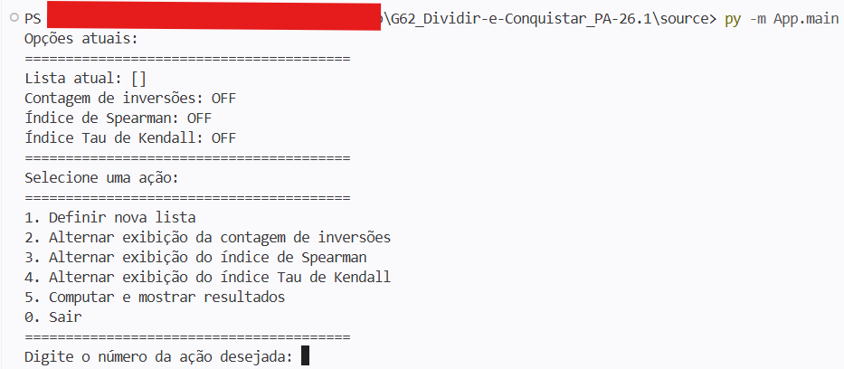
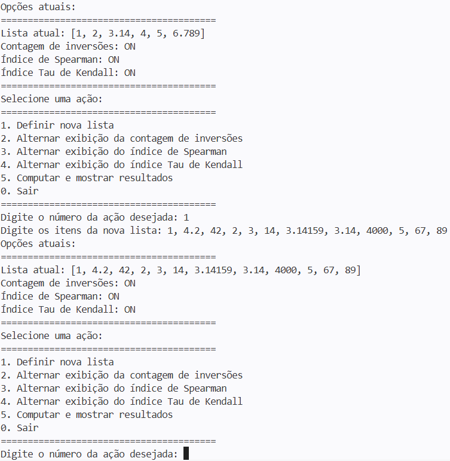
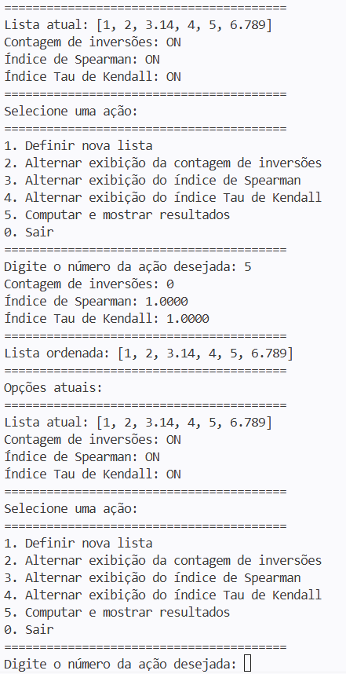
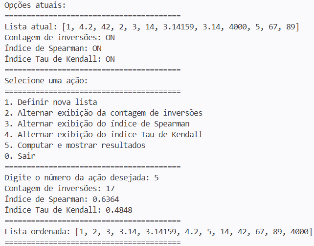
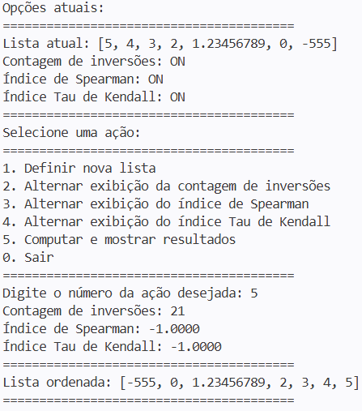

# G62_Dividir-e-Conquistar_PA-26.1
## **Calculadora e Utilidades para Contagem de Inversões** — G62

**Disciplina:** Projeto de Algoritmos 
**Módulo:** Dividir & Conquistar (*Divide & Conquer*) 
**Algoritmo:** Ordenação com Contagem de Inversões 
**Tema:** Ordenador e Calculadora 

## Alunos

| Matrícula | Aluno |
| --------- | ----- |
| 23/1011927  | **João Felipe** Oliveira Alves e Silva |

---

## Sobre
Para este trabalho, se propôs a realização de uma aplicação em linha de comando
para o processamento da ordenação, contagem de inversões e índices estatísticos
— nominalmente, o de Spearman e o Tau de Kendall — a partir desta contagem. 
Para o cumprimento desse objetivo, foi fundamentalmente usado o algoritmo
de **contagem de inversões** discutido e trabalhado neste 3º modúlo do semestre
da disciplina de Projeto de Algoritmos.

## *Screenshots*
### Captura de Tela 1: Menu principal

### Captura de Tela 2: Definição de uma nova lista

### Captura de Tela 3: Execução de todas as operações numa lista ordenada

### Captura de Tela 4: Execução de todas as operações numa lista parcialmente desordenada (embaralhada)

### Captura de Tela 5: Execução de todas as operações numa lista totalmente desordenada (ao contrário)

## Como executar

### Requisitos
Linguagem: Python 
 
O projeto depende basicamente de recursos da própria linguagem Python. É recomendável usar a versão 3.14 em diante pelo fato dela ser a mesma usada para desenvolver a aplicação, mas provavelmente deverá suportar versões 3.x inferiores também. 

### Uso
A aplicação é portátil, e pode ser rodada a partir dos próprios *scripts* já aqui neste repositório. Para executar, simplesmente execute um dos seguintes 2 comandos a partir da pasta `source`: 
* `py -m App.main`
* `py App/main.py`

Ao abrir o *script* `main`, será exibido um menu no *console* conforme a
**Captura de Tela 1**. Digite o número de uma ação a se executar, e pressione a
tecla Enter. Então siga as instruções na tela quando exigido, como a digitação
dos valores requeridos. 

## *Link*(s) do vídeo de entrega
* https://youtu.be/WKhTi2FvtXQ